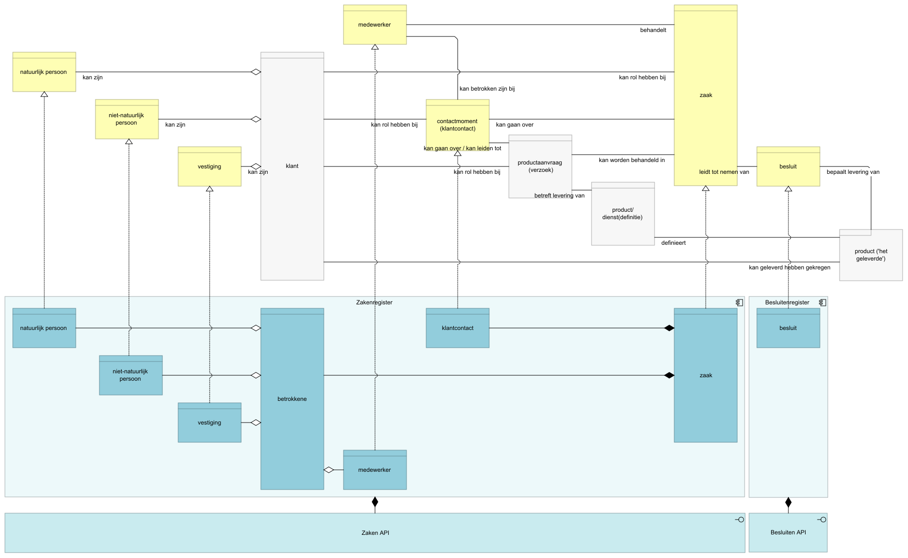
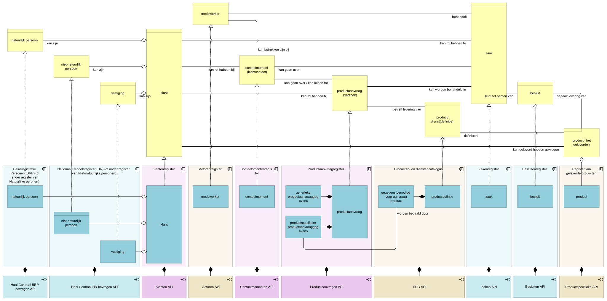

{:height="60%" width="60%"}
*Figuur 1 - Bedrijfs- en dataobjecten bij levering producten en diensten - huidige situatie. In grijs de bedrijfsobjecten (en product) waarvoor geen gestandaardiseerde vastlegging mogelijk is.*

{:height="70%" width="70%"}
*Figuur 2 - Bedrijfs- en dataobjecten bij levering producten en diensten - toekomstige situatie. In roze de elementen die onderdeel zijn van het klantinteracties-project. In oranje later te realiseren elementen.*
