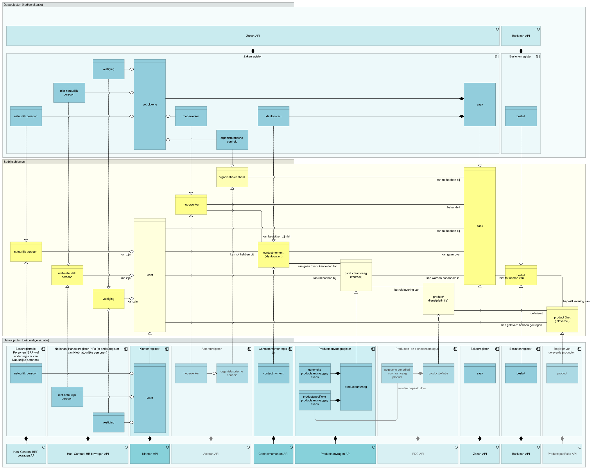

{:height="100%" width="100%"} 
*Figuur 1 - Bedrijfs- en dataobjecten bij levering producten en diensten - huidige en toekomstige situatie. Bedrijfsobjecten (midden) en dataobjecten die deze bedrijfsobjecten realiseren in de huidige (boven) en toekomstige situatie (beneden). Bedrijfsobjecten waarvoor in de huidige situatie geen gestandaardiseerde vastlegging mogelijk is zijn lichtgeel gekleurd. In donkerblauw de elementen die onderdeel zijn van het klantinteracties-project. Nog te realiseren elementen zijn juist lichter weergegeven. Verdeling van data-objecten over geïllustreerde registers en API-interfaces onder voorbehoud van splitsing of samenvoeging.*
